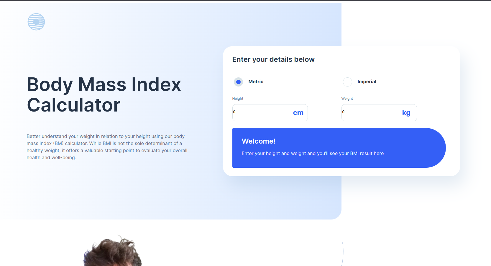

# Frontend Mentor - Body Mass Index Calculator solution

This is a solution to the [Body Mass Index Calculator challenge on Frontend Mentor](https://www.frontendmentor.io/challenges/body-mass-index-calculator-brrBkfSz1T). Frontend Mentor challenges help you improve your coding skills by building realistic projects. 

## Table of contents

- [Overview](#overview)
  - [The challenge](#the-challenge)
  - [Screenshot](#screenshot)
  - [Links](#links)
- [My process](#my-process)
  - [Built with](#built-with)
  - [What I learned](#what-i-learned)
  - [Continued development](#continued-development)
  - [Useful resources](#useful-resources)
- [Author](#author)
- [Acknowledgments](#acknowledgments)

**Note: Delete this note and update the table of contents based on what sections you keep.**

## Overview

### The challenge

Users should be able to:

- Select whether they want to use metric or imperial units
- Enter their height and weight
- See their BMI result, with their weight classification and healthy weight range
- View the optimal layout for the interface depending on their device's screen size
- See hover and focus states for all interactive elements on the page

### Screenshot

### Links

- Solution URL: [https://www.frontendmentor.io/challenges/body-mass-index-calculator-brrBkfSz1T/hub?share=true](https://www.frontendmentor.io/challenges/body-mass-index-calculator-brrBkfSz1T/hub?share=true)
- Live Site URL: [https://frontend-mentor-bmi-calculator.vercel.app](https://frontend-mentor-bmi-calculator.vercel.app)

## My process

### Built with

- Semantic HTML5 markup
- CSS custom properties
- Flexbox
- CSS Grid
- [React](https://reactjs.org/) - JS library
- SASS/SCSS

### What I learned

Doing this challenge really helped to solidify my React skills, which was the main goal of this challenge. However, I also learned a great deal about layout/styling with CSS. I used SASS/SCSS for the first time and I found it really helped me to write more logical and streamlined CSS. However, there are still some issues with my CSS and there's definitely more ways in which I can improve my methodology for writing CSS. I used CSS Grid too, which I haven't used in a while. So, it was good to get a refresher on these topics too.

### Continued development

Were I to continue development on this I would like to revisit my CSS. I would heavily refactor/ start agin. I struggled in particular with the tablet/mobile designs, so perhaps I would try again with a mobile-first workflow. 
I would consider using something like [Bootstrap](https://getbootstrap.com/docs/3.4/css/).

### Useful resources

- [SASS](https://sass-lang.com) - I decided to give SASS a go for the first time, and I found the documentation really useful. It was very easy to get going with my first SCSS file and to set SASS up to watch for changes and compile as I go.

## Author

- Website - [Rowan Jeffery-Wall](https://rowanjefferywall.com)
- Frontend Mentor - [@r-jeffery-wall](https://www.frontendmentor.io/profile/r-jeffery-wall)
- GitHub - [@r-jeffery-wall](https://github.com/r-jeffery-wall)

